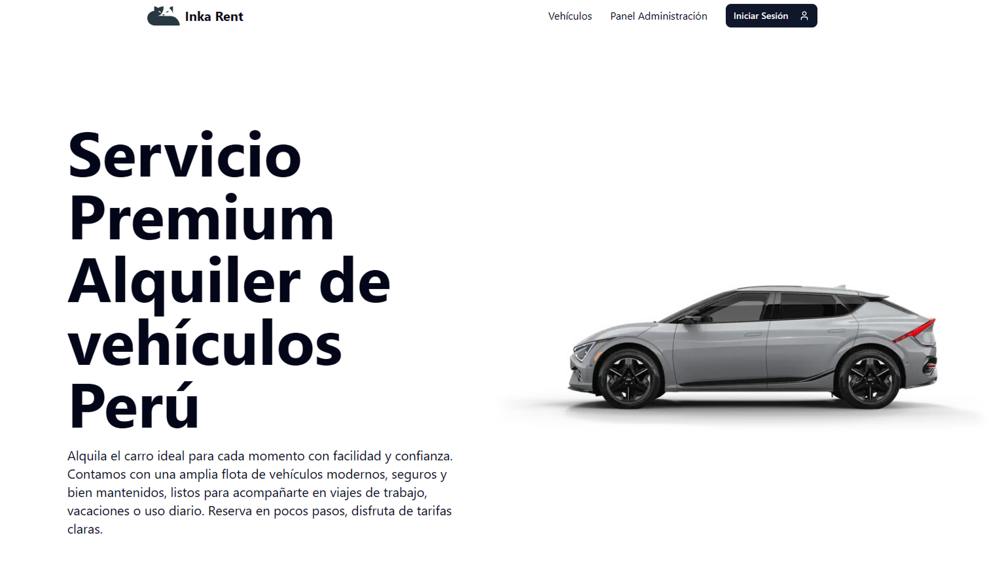
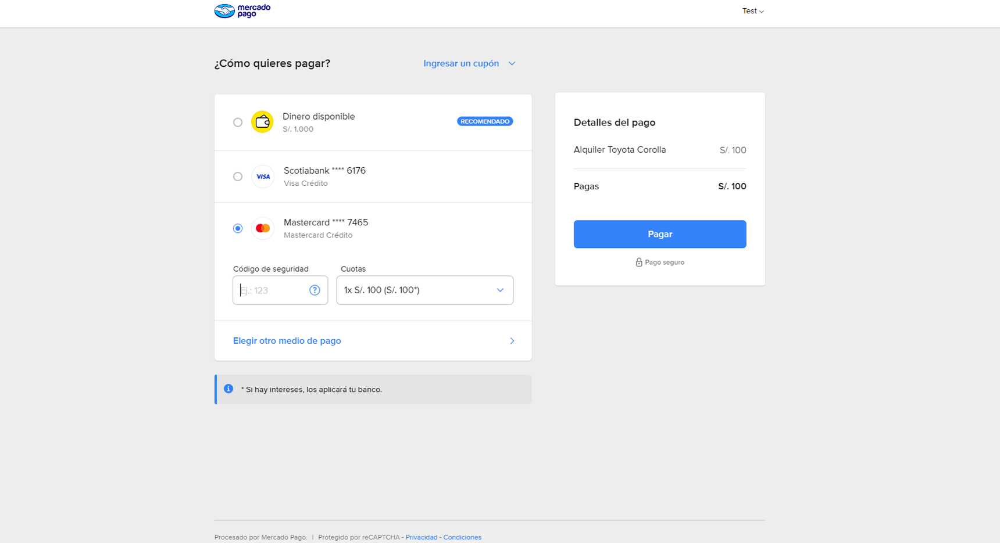
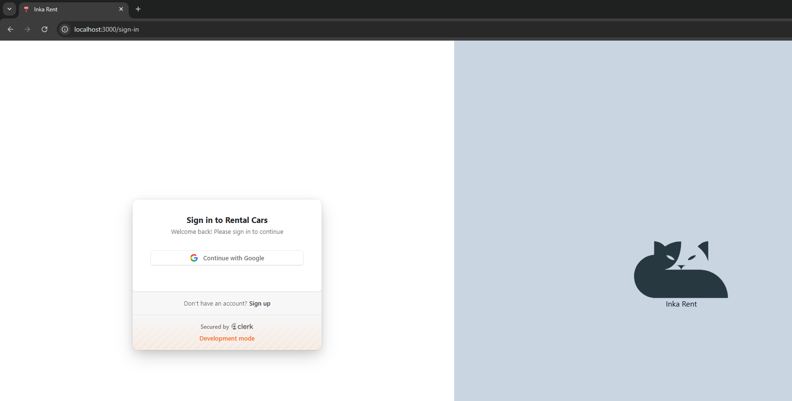
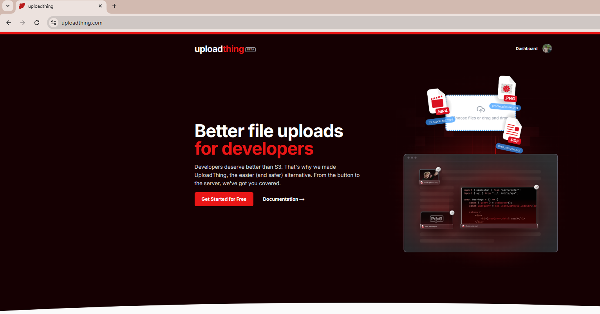
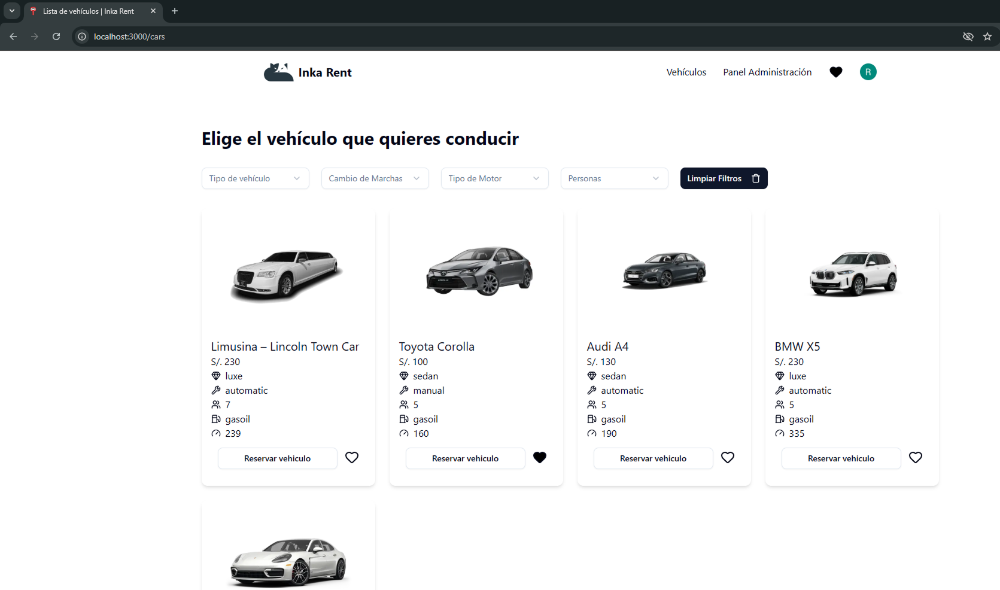
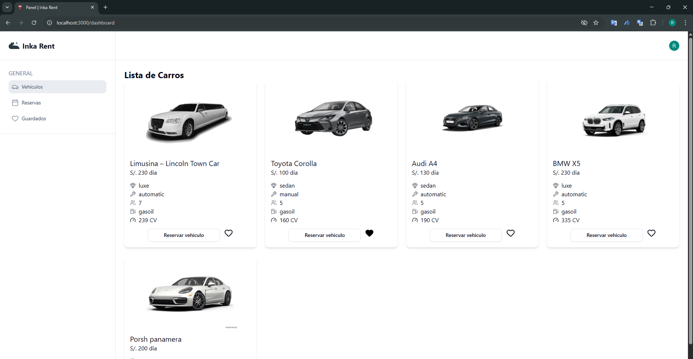
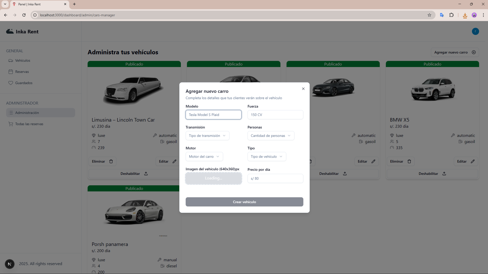
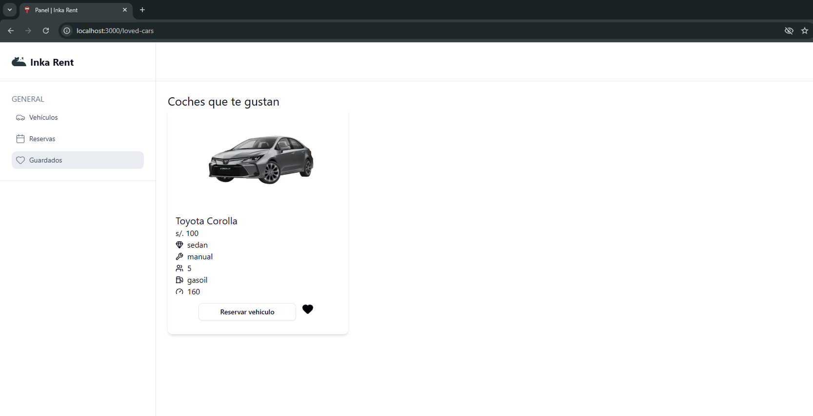

# 🚗 Inka Rent - Sistema de Alquiler de Vehículos

Plataforma moderna y completa para la gestión y alquiler de vehículos en Perú. Desarrollada con las últimas tecnologías web y servicios cloud.

  

Página desplegada en *Vercel* : https://rental-cars-ivory.vercel.app/

## 📋 Tabla de Contenidos

- [Características](#-características)
- [Tecnologías Utilizadas](#-tecnologías-utilizadas)
- [Servicios Integrados](#-servicios-integrados)
- [Capturas de Pantalla](#-capturas-de-pantalla)
- [Licencia](#-licencia)

---

## ✨ Características

- ✅ **Catálogo de vehículos** con filtros avanzados
- ✅ **Sistema de reservas** con calendario interactivo
- ✅ **Autenticación segura** con Clerk
- ✅ **Pagos integrados** con MercadoPago Checkout Pro
- ✅ **Panel de administración** completo
- ✅ **Lista de favoritos** persistente
- ✅ **Responsive design** para todos los dispositivos
- ✅ **Carga de imágenes** optimizada con UploadThing
- ✅ **Base de datos** PostgreSQL con Prisma ORM

---

## 🛠️ Tecnologías Utilizadas

### Frontend

| Tecnología | Versión | Descripción |
|------------|---------|-------------|
| [Next.js](https://nextjs.org/) | 15.5.7 | Framework de React con SSR y App Router |
| [React](https://react.dev/) | 19.1.0 | Biblioteca para interfaces de usuario |
| [TypeScript](https://www.typescriptlang.org/) | 5.x | Superset de JavaScript con tipado estático |
| [Tailwind CSS](https://tailwindcss.com/) | 4.x | Framework de CSS utility-first |
| [Shadcn/ui](https://ui.shadcn.com/) | - | Componentes de UI accesibles y personalizables |
| [Lucide React](https://lucide.dev/) | 0.548.0 | Iconos SVG modernos |

### Backend

| Tecnología | Versión | Descripción |
|------------|---------|-------------|
| [Prisma](https://www.prisma.io/) | 6.18.0 | ORM de próxima generación para Node.js |
| [PostgreSQL](https://www.postgresql.org/) | - | Base de datos relacional |
| [Clerk](https://clerk.com/) | 6.34.1 | Autenticación y gestión de usuarios |
| [Zod](https://zod.dev/) | 4.1.12 | Validación de esquemas TypeScript-first |

### Librerías Adicionales

- **React Hook Form** (7.66.0) - Gestión de formularios performante
- **Axios** (1.13.2) - Cliente HTTP
- **Date-fns** (4.1.0) - Manipulación de fechas
- **Sonner** (2.0.7) - Notificaciones toast elegantes
- **Zustand** (implícito en use-loved-cars) - Estado global ligero

---

## 🌐 Servicios Integrados

### Pagos

- **MercadoPago Checkout Pro** - Procesamiento de pagos seguro
  - Múltiples métodos de pago

### Autenticación

- **Clerk** - Sistema completo de autenticación
  - Login/Registro con email
  - OAuth (Google, GitHub, etc.)
  - Gestión de sesiones
  - Protección de rutas

### Almacenamiento

- **UploadThing** - Subida de imágenes optimizada
  - CDN global
  - Compresión automática
  - Procesamiento de imágenes

### Base de Datos

- **Neon PostgreSQL** - Base de datos serverless
  - Auto-scaling
  - Branching de BD
  - Backups automáticos

---

## 📸 Capturas de Pantalla

### 🏠 Página Principal

---

### 🚙 Catálogo de Vehículos

*Grid responsivo con filtros avanzados, sistema de favoritos y modal de reserva integrado.*

---

### 📋 Panel de Administración

---

### ✏️ Gestión de Vehículos

*CRUD completo de vehículos con carga de imágenes, validaciones*

---

### 💳 Proceso de Pago

*Integración con MercadoPago Checkout Pro para pagos seguros y confirmación de reserva.*

---

### ❤️ Favoritos

*Lista de vehículos favoritos con persistencia local mediante Zustand.*

---
## 🔧 Construcción

1. Se esta construyendo la implementación de `WEBHOOKS` con mercadopago para la comunicación con el servidor y el manejo de estados de pago.

2. Se esta construyendo el modo `DARK/LIGHT`
3. Se esta construyendo la funcionalidad de `INGLÉS/ESPAÑOL`

---

## 📝 Licencia

Este proyecto está bajo la Licencia MIT. Ver el archivo `LICENSE` para más detalles.

---

## 👨‍💻 Autor

**Tu Nombre**

- GitHub: [@rjproa](https://github.com/rjproa)
- LinkedIn: [Richard Vega Proa](https://www.linkedin.com/in/richard-vega-proa-1b4791299/)
- Email: rjvegaproa@gmail.com

---

**Hecho con ❤️ en Perú 🇵🇪**

